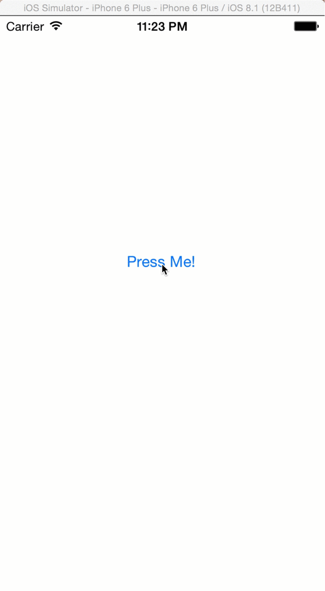

# JDFNotificationView

`JDFNotificationView` is a simple `UIView` subclass that makes it easy to show simple notifications to the user without getting in their way.
 
 To use, simply create an instance, setup any options, and call one of the `show` methods, supplying the view you want it to be shown from. The notification will automatically dismiss itself after a certain amount of time.
 
 

## Usage

To run the example project, clone the repo, and run `pod install` from the Example directory first.

## Installation

JDFNotificationView is available through [CocoaPods](http://cocoapods.org). To install it, simply add the following line to your Podfile:

    pod "JDFNotificationView"

## Todo

Here is a list of things to be added to this component:

* The ability to manually dismiss a notification early
* More animation options
* The option to add an image to the notification

## Author

Joe Fryer, joe.d.fryer@gmail.com

## License

JDFNotificationView is available under the MIT license. See the LICENSE file for more info.

